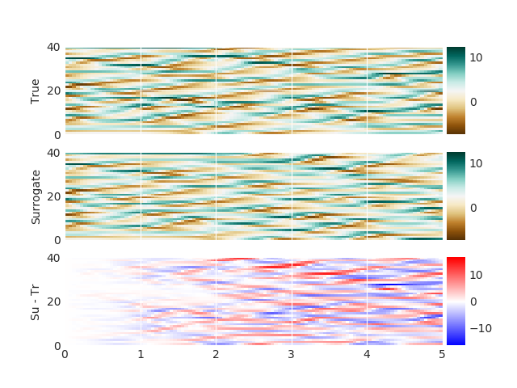

# GMD-code
This repository is a set a function implementing the method described in the paper: 
"Combining data assimilation and machine learning to emulate a dynamical model from sparse and noisy observations"
by Julien Brajard, Alberto Carrassi, Marc Bocquet, and Laurent Bertino.

A example script is provided to run the "reference setup" described in the paper.

## Installation

Tested on Linux/MacOS[1](#myfootnote1)
1. Prerequisiste: `python3.5+` (suggest setting it up with
[anaconda](https://www.anaconda.com/download)).
2. Download [DAPPER v0.8](https://github.com/nansencenter/DAPPER/releases/tag/v0.8) 
3. Copy the following files in the DAPPER main directory (suggest download the whole [repository](https://github.com/brajard/GMD-code/releases/tag/v0.1)):
   - [utils.py](utils.py)
   - [requirements.txt](requirements.txt)
   - [example.py](example.py)
   - (optional) [plot_simu.py](plot_simu.py)
4. Create a directory to save results: `mkdir example_data`
5. Install the required python modules: `pip install -r requirements.txt`
6. Run the exemple file (you can modify the file to speed up the run): `python exemple.py`

## Results

The code [example.py](example.py) will run the algorithm described in the paper for the standard setup 
(to run the other setups, you can modify the [example.py](example.py) code). The standard experiment run can take several hours.

The output of the code are saved on the `example_data` directory:
- `weights_init.h5`: initial weights of the neural network
- `weights_nn.h5`: weights of the neural network after optimization
- `simulation.png`: figure showing one simulation of 5 unit time steps (about 8 Lyapunov time steps).

If the algorithm has run at least once, and you have already produced weights saved in `example_data/weights_nn.h5`, you can run the code [plot_simu.py](plot_simu.py) to load the weights and make only a simulation and a plot without the long optimization setup: `python plot_simu.py`

In the file `simulation.png`, you should obtained the following figure:

<a name="myfootnote1">1</a>: For MacOS, the `pythonw` was used after installion through `conda install python.app`

